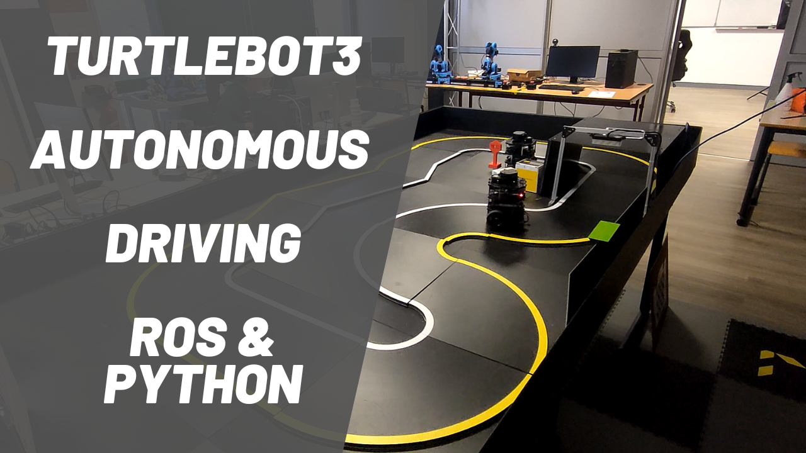
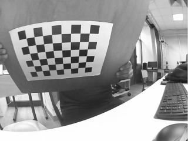
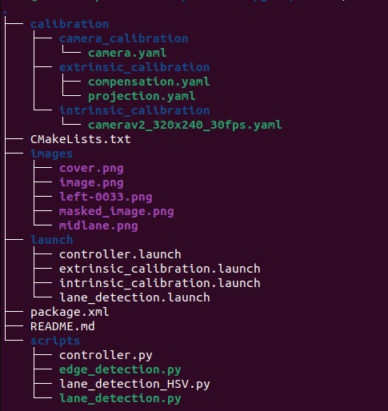
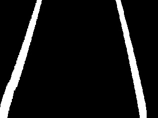
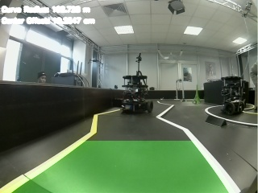
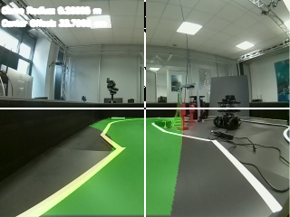
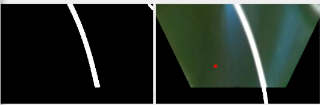
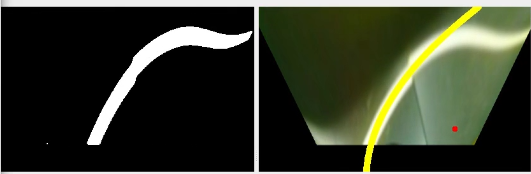
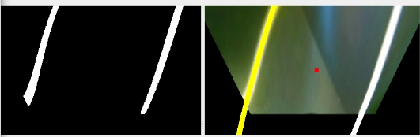

# Autonomous-Driving Turtlebot3 Using Camera based Lane Tracking

Supervised by: Renato Martins (@renatojmsdh) DUVERNE Raphael  (@duverneraphael) Joaquin Jorge Rodriguez (@joako1991) 
Submitted By: Mutte Ur Rehman (@muttequrashi) Hussein Loubani (@husein-loubani)



## Project Goal
Autonomous Driving of a Ground Differential Robot by Perception based on [Autorace Challenge][1]. Main task was to detect the lanes and make the robot follow lane and complete the mission. In the circuit provided robot has to go through a low light tunnel also.

## Required Libraries and Packages to Start
      ros-noetic-image-transport 
      ros-noetic-cv-bridge 
      ros-noetic-vision-opencv 
      opencv 
      libopencv-dev 
      ros-noetic-image-proc
      Autorace package

## First Step Installing the Required Packages .
For this step we have followed the instructions provided on [emanual robotics][1].
Install the AutoRace 2020 meta package on Remote PC.

      cd ~/catkin_ws/src/
      git clone -b noetic-devel https://github.com/ROBOTIS-GIT/turtlebot3_autorace_2020.git
      cd ~/catkin_ws && catkin_make
            
Install additional dependent packages on Remote PC.

      sudo apt install ros-noetic-image-transport ros-noetic-cv-bridge ros-noetic-vision-opencv python3-opencv libopencv-dev ros-noetic-image-proc

## Connecting to Turtlebot3

Connecting to turtlebot over ssh with password napelturbot

      ssh ubuntu@192.168.0.200
      
 This is very important to bringup the turtlebot before running any node related to camera to robot control. 
 
Bring Up Turtlebot on PI.

     roslaunch turtlebot3_bringup turtlebot3_robot.launch 

## Camera Calibaration

For Camera Callibration we have done the same proccedure as listed below. We used the autorace camera package to get the undistorted image so we can perform the lane detection.

Launch roscore on Remote PC.
      
      roscore
Trigger the camera on SBC.
      
      roslaunch turtlebot3_autorace_camera raspberry_pi_camera_publish.launch

### Intrinsic Camera Calibration
After launching the camera node from raspberry pi we can now run the following package on remote pc to do the camera calibration. We used the checkboard pattern to do this task. 

      roslaunch turtlebot3_autorace_camera intrinsic_camera_calibration.launch mode:=calibration
      
One of the multiple pictures taken during calibration proccess is listed below.



After completing the callibration we saved the data. By default calibrationdata.tar.gz is created at /tmp folder on remote pc. This compressed folder contain the sample images as well as the callibration data in a file named ost.yaml. For using the Autorace Camera package we copied the calibration file data and pasted into the file present in the Autorace Race package named [camerav2_320x240_30fps.yaml](/calibration/intrinsic_calibration/camerav2_320x240_30fps.yaml) 

### Extrinsic Camera Callibration

Open a new terminal and launch the intrinsic camera calibration node.
      
      roslaunch turtlebot3_autorace_camera intrinsic_camera_calibration.launch
Open a new terminal and launch the extrinsic camera calibration node.

      roslaunch turtlebot3_autorace_camera extrinsic_camera_calibration.launch mode:=calibration

Now to set the region of interest and the warping parameters for projected image we can run the following command in new terminal.
      
      rosrun rqt_reconfigure rqt_reconfigure

After the extrinsic callibration the results are stored in  turtlebot3_autorace_camera/calibration/extrinsic_calibration/ having two files compensation.yaml and projection.yaml. We copied those files to our package so we can use them to republish the topic coming from raspberry pi after applying the desired projection and compensation. These file are located at [Extrinsic Calibration Files](/calibration/extrinsic_calibration)

## ROS Package
Overall structure of the ros packge is shown below.



As seen in the above picture we have 4 different launch files [extrinsic_calibration.launch](launch/extrinsic_calibration.launch), [intrinsic_calibration.launch](launch/intrinsic_calibration.launch), [controller.launch](launch/controller.launch) and [lane_detection.launch](launch/lane_detection.launch).

First two the extrinsic_calibration.launch and intrinsic_calibration.launch are responsible to subscribe to camera topic "camera/image/compressed" and then applying the projection and compensation and then publishing it on topics "/camera/image_projected/compressed/", "/camera/image_projected_compensated/compressed". 

We will use these topics to get the projected camera image and perform lane detection. The lane_detection.launch file is running the [lane_detection.py](scripts/lane_detection.py) which is subscribbing to /camera/image_projected/compressed/ performs lane detection and then publishs the thresholding results on "/camera/mask_lane_detected/compressed" and the final lane detection on "/camera/midlane_detected/compressed" and the detected midpoint location in pixels on "/detect/lane". 

The [controller.launch](launch/controller.launch) runs the [controller.py](scripts/controller.py) which subscribes to "/detect/lane", "/control/max_vel"
and publishes the required velocity on turtlebot velocity topic "/cmd_vel".
Till now we have tested the lane tracking with a PD controller.

## Lane Detection

For lane detection we are using two different types of threshold values depending on the maximum intensity of pixel in the image. This was implemented to overcome the issue of low light in the tunnel. Our lane detection is mainly based on binary thresholding of the projected image and then creating a histogram. We have 3 different conditions to check if the robot should turn right, left or it should move straight. We are doing that by checking the value of pixels in the right and left half of the histogram. if both halfs have the line we publish the value of center to the "/detect/lane" topic that means robot should move straight. 
Our main idea of lane detection was inspired by [The Ultimate Guide to Real-Time Lane Detection Using OpenCV][2]. We tried implementing this code with our ROS packge but the results were not very great so due to time contraints we moved to binary thresholding and using some part of the code from [The Ultimate Guide to Real-Time Lane Detection Using OpenCV][2]. The files for this implementation are [lane_detection_1.py](scripts/lane_detection_1.py) and [edge_detection.py](scripts/edge_detection.py)

**Algorithm Steps

      Thresholding
      Apply Perspective Transformation to Get a Bird’s Eye View
      Identify Lane Line Pixels
      Set Sliding Windows for White Pixel Detection
      Fill in the Lane Line
      Overlay Lane Lines on Original Image
      Calculate Lane Line Curvature
      Calculate the Center Offset
      Display Final Image
      Publish Center to controller

The results were good on the straight path for a short distance but for longer distance it was not very satifactory.
Some results from the above mentioned algorythem 
<p float="left">
  
   
  
</p>


The code we deloped in the end and used for our final evaluation is [lane_detection.py](scripts/lane_detection.py).

**Algorithm Steps

      Subscribing and Publishing topics

```python
self.image_lane_sub = rospy.Subscriber('/camera/image_projected/compressed', CompressedImage, self.callback, queue_size = 1, buff_size=2**24)
self.detect_midlane_pub = rospy.Publisher('/camera/midlane_detected/compressed', CompressedImage, queue_size = 1)
self.detect_mask_lane_pub = rospy.Publisher('/camera/mask_lane_detected/compressed', CompressedImage, queue_size = 1)
self.pub_lane = rospy.Publisher('/detect/lane', Float64, queue_size = 1)
```
      Thresholding with two different values 
```python
np_arr = np.fromstring(image_msg.data, np.uint8)
img = cv2.imdecode(np_arr, cv2.IMREAD_COLOR)
gray = cv2.cvtColor(img, cv2.COLOR_BGR2GRAY)
# filter image to remove noise or smoothing the image
gray = cv2.medianBlur(gray,9)
if gray.max() < 190:
      # create a binary thresholded image on grayscale image between white and yellow
      thresh = cv2.inRange(gray, 120, 190)
else:
      # create a binary thresholded image on grayscale image between white and yellow
      thresh = cv2.inRange(gray, 200, 255)       
```
      Identify Lane Line Pixels
```python
histogram = np.sum(warped[warped.shape[0]//2:,:], axis=0)
# Peak in the first half indicates the likely position of the left lane
half_width = np.int(histogram.shape[0]/2)
leftx_base = np.argmax(histogram[:half_width])
#second half indicates the likely position of the right lane
rightx_base = np.argmax(histogram[half_width:]) + half_width
```
      Set Sliding Windows for White Pixel Detection
```python
for window in range(nwindows):
            # Identify window boundaries in x and y (and right and left)
            win_y_low = warped.shape[0] - (window+1)*window_height
            win_y_high = warped.shape[0] - window*window_height
            win_xleft_low = leftx_current - margin
            win_xleft_high = leftx_current + margin
            win_xright_low = rightx_current - margin
            win_xright_high = rightx_current + margin
            good_left_inds = ((nonzeroy >= win_y_low) & (nonzeroy < win_y_high) & 
            (nonzerox >= win_xleft_low) &  (nonzerox < win_xleft_high)).nonzero()[0]
            good_right_inds = ((nonzeroy >= win_y_low) & (nonzeroy < win_y_high) & 
            (nonzerox >= win_xright_low) &  (nonzerox < win_xright_high)).nonzero()[0]
            # Append these indices to the lists
            left_lane_inds.append(good_left_inds)
            right_lane_inds.append(good_right_inds)
            # If you found > minpix pixels, recenter next window on their mean position
            if len(good_left_inds) > minpix:
                leftx_current = np.int(np.mean(nonzerox[good_left_inds]))
            if len(good_right_inds) > minpix:        
                rightx_current = np.int(np.mean(nonzerox[good_right_inds]))
        
# Concatenate the arrays of indices
left_lane_inds = np.concatenate(left_lane_inds)
right_lane_inds = np.concatenate(right_lane_inds)
# Extract left and right line pixel positions
leftx = nonzerox[left_lane_inds]
lefty = nonzeroy[left_lane_inds] 
rightx = nonzerox[right_lane_inds]
righty = nonzeroy[right_lane_inds] 

```
      Fill in the Lane Line
```python
# Fit a second order polynomial to each
        try:
            right_fit = np.polyfit(righty, rightx, 2)   
            self.right_lane_fit_bef = right_fit
        except:
            right_fit = self.right_lane_fit_bef

        try:
            
            left_fit = np.polyfit(lefty, leftx, 2)
            self.left_lane_fit_bef = left_fit
        except:
            left_fit = self.left_lane_fit_bef

        # Generate x and y values for plotting
        ploty = np.linspace(0, warped.shape[0]-1, warped.shape[0] )
        try:
            left_fitx = left_fit[0]*ploty**2 + left_fit[1]*ploty + left_fit[2]
        except:
            pass

        try:
            right_fitx = right_fit[0]*ploty**2 + right_fit[1]*ploty + right_fit[2]
        except:
            pass
```
      Detect Left, Right Lanes calculate center point
```python
if leftx_base < 100 and rightx_base > 600:
            cx, cy, _, _ = getPerpCoord(right_fitx[300], 300, right_fitx[301], 301, 255)
            img = cv2.circle(img, (cx,cy), radius=10, color=(0, 0, 255), thickness=-1)
            right_lane=np.array([np.transpose(np.vstack([right_fitx, ploty]))])
            final = cv2.polylines(img, np.int_([right_lane]), isClosed=False, color=(255, 255, 255), thickness=24)
            if not self.log_status == 'right':
                rospy.loginfo('Detect only right lane')
                # self.prev_time = time.time()
                self.log_status = 'right'

        elif   leftx_base > 100 and rightx_base < 600:
            cx, cy, _, _ = getPerpCoord(left_fitx[300], 300, left_fitx[301], 301, -255)
            #print('CX Left line', cx)
            img = cv2.circle(img, (cx,cy), radius=10, color=(0, 0, 255), thickness=-1)
            left_lane=np.array([np.transpose(np.vstack([left_fitx, ploty]))])
            final = cv2.polylines(img, np.int_([left_lane]), isClosed=False, color=(0, 255, 255), thickness=24)
            if not self.log_status == 'left':
                rospy.loginfo('Detect only left lane')
                # self.prev_time = time.time()
                self.log_status = 'left'

        elif leftx_base > 100 and rightx_base > 700:
            cx = int(round(np.mean([left_fitx[300], right_fitx[300]], axis=0)))
            
            img = cv2.circle(img, (cx, 300), radius=10, color=(0, 0, 255), thickness=-1)
            left_lane=np.array([np.transpose(np.vstack([left_fitx, ploty]))])
            right_lane=np.array([np.transpose(np.vstack([right_fitx, ploty]))])
            final = cv2.polylines(img, np.int_([left_lane]), isClosed=False, color=(0, 255, 255), thickness=24)
            final = cv2.polylines(final, np.int_([right_lane]), isClosed=False, color=(255, 255, 255), thickness=24)
            if not self.log_status == 'both':
                rospy.loginfo('Detect both lanes')
                # self.prev_time = time.time()
                self.log_status = 'both'

        else:
            cx = 470
            final = img
            if not self.log_status == None:
                rospy.loginfo('There is no lane')
                # self.prev_time = time.time()
                self.log_status = None
```
      
      
      Publish Center to controller and results to Above mentioned topics
```python
self.pub_lane.publish(msg_desired_center)
self.detect_mask_lane_pub.publish(self.cvBridge.cv2_to_compressed_imgmsg(thresh, "jpg"))
self.detect_midlane_pub.publish(self.cvBridge.cv2_to_compressed_imgmsg(final, "jpg"))
```

### Lane Detection Results

Right Lane Detected.


Left Lane Detected.


Both Lanes Detected.


## Controller

For this project we have used a PD controller. Controller class is defined in [controller.py](scripts/controller.py). 

PD controller:
  

Working of controller class is as followes:

      Subscribe to topics by lane detection to get the center point and publish to turtlebot velocity topic
```python
self.sub_lane = rospy.Subscriber('/detect/lane', Float64, self.cbFollowLane, queue_size = 1)
self.sub_max_vel = rospy.Subscriber('/control/max_vel', Float64, self.cbGetMaxVel, queue_size = 1)
self.pub_cmd_vel = rospy.Publisher('/cmd_vel', Twist, queue_size = 1)
```
      Get the center point and calculate error and then compute velocity to minimize the error 470 is value of center we fixed (set point)
      Linear velocity for this project is fixed we only change the rotational velocity
```python
        center = desired_center.data
        error = center - 470
        current_time = time.time()
        Kp = 0.0001
        Kd = 0.001
        ki=0
        dt=current_time-self.prev_time
        self.integral= (self.integral + error)*dt
        self.angular_z += Kp * (error - self.lastError) + Kd * (error - 2 * self.prevError + self.lastError) +ki *self.integral   
        self.angular_z += Kp * (error - self.lastError) + Kd * (error - 2 * self.prevError + self.lastError)
        self.prevError = self.lastError
        self.lastError = error
        twist = Twist()
        twist.linear.x = 0.06       
        twist.linear.y = 0
        twist.linear.z = 0
        twist.angular.x = 0
        twist.angular.y = 0
        twist.angular.z = -max(self.angular_z, -1.0) if self.angular_z < 0 else -min(self.angular_z, 1.0)
        self.prev_time=current_time
```
        Publish Velocity
```python
        self.pub_cmd_vel.publish(twist)
        
```
# To Run this code


To Run the code we need to do following steps on remote PC and Turtlebot.

- Run ros master on PC. 

      roscore
 
- Connecting to Turtlebot3

  Connecting to turtlebot over ssh with password napelturbot

      ssh ubuntu@192.168.0.200
      
- Bring Up Turtlebot on PI.

     roslaunch turtlebot3_bringup turtlebot3_robot.launch 

-Start Capturing from Camera.

     roslaunch turtlebot3_autorace_camera raspberry_pi_camera_publish.launch
     
- On PC we have to run following files to start lane detection and tracking in seprate terminals.
         
      roslaunch group_4 extrinsic_calibration.launch
      roslaunch group_4 intrinsic_calibration.launch 
      roslaunch group_4 lane_detection.launch 
      roslaunch group_4 controller.launch
- In another terminal open 

      rqt_image_view

The results can be viewed on the topics.

      /camera/image/compressed
      /camera/image_projected/compressed/ 
Thresholding results on 
      
      /camera/mask_lane_detected/compressed
Final lane detection on 

      /camera/midlane_detected/compressed


## Demo and Trial Videos

**Previous Trial Video.

<p float="middle">
  
</p>

**Complete Run Video.

<p float="middle">
  
</p>

[1]:https://emanual.robotis.com/docs/en/platform/turtlebot3/autonomous_driving/#autonomous-driving
[2]: https://automaticaddison.com/the-ultimate-guide-to-real-time-lane-detection-using-opencv/
